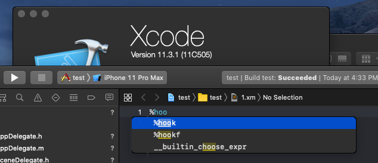

# Logos-Xcode11+ 
#### Logos Syntax Highlight in Xcode 
Logos-Xcode brings Logos Syntax Hightlight to Xcode (tested on 11.3). 

## How To Install on Xcode 11+
0 - You should make a backup of the folder `/Applications/Xcode.app/Contents/SharedFrameworks/DVTFoundation.framework/Versions/A/Resources`  
1 - You should make a backup of the folder `/Applications/Xcode.app/Contents/SharedFrameworks/SourceModel.framework/Versions/A/Resources`  
2 - Clone this repo .  
3 - Cd to the folder with `cd Logos-Xcode/src`.  
4 - (Important) Assert that Xcode is completed terminated.  
5 - (Optional) To create `Logos.xclangspec`, run `python(3) xclangspec_generator.py`.  
6 - If you want to install to Xcode-beta.app, you can rename it to Xcode.app before installation and revert it after installation.
7 - Run `./add_current_uuid.sh`
8 - Run `sudo ./install.sh`, to run the installation script.  

## Credits

* [apollographql / xcode-graphql](https://github.com/apollographql/xcode-graphql)

# ------------------------------------------------------------
# Original README
## How To Install
0 - You should make a backup of the folder `/Applications/Xcode.app/Contents/SharedFrameworks/DVTFoundation.framework/Versions/A/Resources`  
1 - Clone this repo `git clone https://github.com/pr0crustes/Logos-Xcode` to any place you want.  
2 - Cd to the folder with `cd Logos-Xcode`.  
3 - Assert that Xcode is completed terminated.  
4 - To create `Logos.xclangspec`, run `python(3) xclangspec_generator.py`.  
5 - Run `chmod +x install.sh`, in order to give execution rights.  
6 - Run `sudo ./install.sh`, to run the installation script.  
7 - The script should explain itself, just follow the instructions.  
  
### Explaining Why It Needs Root 
To be honest, I hate when a script can only be run as root (security reasons), but in this case that's needed for writing to `/Applications/Xcode.app/Contents/SharedFrameworks/DVTFoundation.framework/Versions/A/Resources`.  
You do not need to trust my word, since all the code is open source and I suggest everyone to read.  
  
## Images

  
## Disclaimer
This code is provided `as it is`, without any `warranty`.  
READ all the code before using it, since I am not responsible if it eventually breaks any future xcode version.  
  
## Based on the work of: 
* Tiago Bastos (Fork) 
* Alex Karahalios (Install Script) 
* Bret Victor (Syntax file) 
* Graham Henstridge (Syntax file) 
* This project started as a fork from https://github.com/bastos/lua-xcode-coloring
